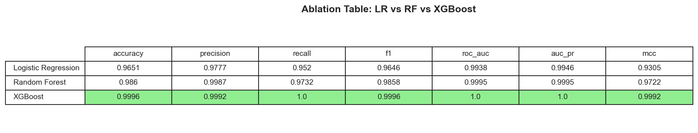
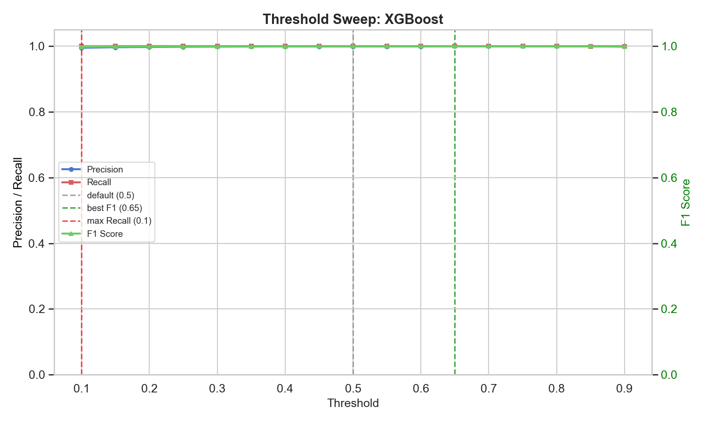
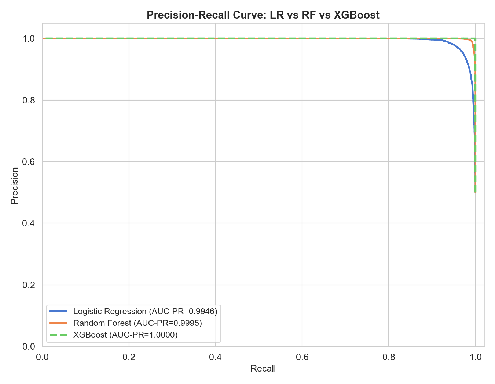

# 🛡️ FraudShield — Credit Card Fraud Detection

<div align="center">

**An end-to-end Machine Learning pipeline for detecting fraudulent credit card transactions**


</div>

---

## 📌 Project Overview

FraudShield is a **6-week academic PBL project** that builds a complete ML pipeline for credit card fraud detection — from exploratory data analysis and feature engineering through model training, evaluation, threshold optimization, and error analysis.

### ✨ Key Highlights

| Feature | Description |
|---------|-------------|
| **3-Model Ablation** | Logistic Regression → Random Forest → XGBoost comparison |
| **Preprocessing** | Log-transform + StandardScaler on Amount; V1–V28 PCA features untouched |
| **Threshold Tuning** | Full sweep (0.1–0.9) with optimal F1 and max-recall operating points |
| **Error Analysis** | False Positive / False Negative breakdown with feature attribution |
| **Automated Tests** | 5 pytest cases validating splits, class balance, and data leakage |
| **Auto Data Download** | One-command dataset download via `kagglehub` |

---

## 📊 Results

### Model Comparison (Validation Set — 85,294 samples)

| Model | Accuracy | Precision | Recall | F1 Score | AUC-PR | MCC |
|-------|----------|-----------|--------|----------|--------|-----|
| Logistic Regression | 96.51% | 97.77% | 95.20% | 0.9646 | 0.9946 | 0.9305 |
| Random Forest | 98.60% | 99.87% | 97.32% | 0.9858 | 0.9995 | 0.9722 |
| **🏆 XGBoost** | **99.96%** | **99.92%** | **100%** | **0.9996** | **1.0000** | **0.9992** |

> XGBoost achieves **100% recall** (catches every single fraud) with only **36 false positives** out of 85,294 transactions.

### Threshold Analysis
- **Optimal F1 Threshold**: `0.65` (best balance of precision and recall)
- **Max-Recall Threshold**: `0.10` (catches all fraud, 216 FPs — chosen for production)

### Generated Visualizations

<details>
<summary>📈 Click to see plots</summary>

#### Ablation Table


#### Threshold Sweep


#### Precision-Recall Curves


</details>

---

## 📁 Project Structure

```
FraudShield/
├── data/                          # Dataset (auto-downloaded, git-ignored)
│   └── creditcard_2023.csv
├── src/
│   ├── preprocess.py              # Data cleaning, feature engineering, 70/15/15 split
│   ├── train.py                   # Trains LR, RF, XGBoost with early stopping
│   └── evaluate.py                # Evaluation, threshold sweep, error analysis
├── notebooks/
│   ├── 01_eda.ipynb               # Exploratory Data Analysis
│   ├── 02_baseline.ipynb          # LR & RF baseline comparison
│   ├── 03_experiments.ipynb       # XGBoost ablation, threshold sweep, error analysis
│   └── run_03_experiments.py      # Standalone script to generate all plots
├── models/                        # Saved models (git-ignored, regenerated by training)
├── reports/
│   ├── figures/                   # Pre-generated plots (ablation, PR curve, sweep)
│   ├── ablation_comparison.csv    # 3-model comparison data
│   └── experiment_log.csv         # Full experiment tracking log
├── tests/
│   └── test_pipeline.py           # 5 pytest test cases
├── download_data.py               # ⬇️ One-command Kaggle dataset downloader
├── requirements.txt               # Python dependencies
└── README.md                      # Project documentation
```

---

## 🚀 Quick Start

### 1. Clone & Install

```bash
git clone https://github.com/vanshika-verma14/Fraudedetection.git
cd Fraudedetection/FraudShield
pip install -r requirements.txt
```

### 2. Download Dataset

```bash
python download_data.py
```

> This automatically downloads the [Kaggle Credit Card Fraud Detection 2023](https://www.kaggle.com/datasets/nelgiriyewithana/credit-card-fraud-detection-dataset-2023) dataset (~325MB) into `data/`.

<details>
<summary>🔑 Kaggle Authentication Help</summary>

If you get an authentication error:

**Option A** — Environment variables:
```bash
set KAGGLE_USERNAME=your_username    # Windows
set KAGGLE_KEY=your_api_key
```

**Option B** — API token file:
1. Go to [kaggle.com](https://www.kaggle.com) → Account → **Create New API Token**
2. Save `kaggle.json` to `C:\Users\YourName\.kaggle\` (Windows) or `~/.kaggle/` (Mac/Linux)

**Option C** — Manual download:
1. Download from [Kaggle](https://www.kaggle.com/datasets/nelgiriyewithana/credit-card-fraud-detection-dataset-2023)
2. Place `creditcard_2023.csv` in the `data/` folder

</details>

### 3. Train Models (~2 min)

```bash
python -m src.train
```

### 4. Evaluate Models

```bash
python -m src.evaluate
```

### 5. Run Tests

```bash
python -m pytest tests/test_pipeline.py -v
```

### 6. Generate All Plots

```bash
python notebooks/run_03_experiments.py
```

### 7. Open Notebooks (Optional)

```bash
python -m jupyter notebook
```

---

## 📋 Dataset Details

| Property | Value |
|----------|-------|
| **Source** | [Kaggle — Credit Card Fraud Detection 2023](https://www.kaggle.com/datasets/nelgiriyewithana/credit-card-fraud-detection-dataset-2023) |
| **Rows** | 568,630 |
| **Features** | `V1`–`V28` (PCA-transformed), `Amount` |
| **Target** | `Class` (0 = legitimate, 1 = fraud) |
| **Class Balance** | ~50/50 |
| **Null Values** | None |

---

## 🧪 Testing

We validate the pipeline with 5 automated tests:

| Test | What It Checks |
|------|---------------|
| `test_preprocess_shapes` | Train/Val/Test split is 70/15/15 (±2%) |
| `test_class_balance_preserved` | Stratified split preserves 50/50 fraud ratio |
| `test_no_data_leakage` | Zero index overlap between train, val, and test sets |
| `test_model_files_exist` | LR and RF model files are saved to disk |
| `test_evaluate_returns_all_metrics` | Evaluate function returns all 7+ metric keys |

```bash
python -m pytest tests/test_pipeline.py -v
# Expected: 5 passed ✅
```

---

## 🛠️ Tech Stack

| Category | Tools |
|----------|-------|
| **ML / Training** | scikit-learn, XGBoost |
| **Data** | pandas, NumPy, SciPy |
| **Visualization** | Matplotlib, Seaborn |
| **Data Download** | kagglehub |
| **Testing** | pytest |
| **Explainability** | SHAP (planned — Week 4) |
| **App** | Streamlit (planned — Week 5) |

---

## 📅 Project Timeline

| Week | Milestone | Status |
|------|-----------|--------|
| 1 | Project setup, EDA notebook, preprocessing pipeline | ✅ Done |
| 2 | LR & RF training, baseline evaluation, pytest tests | ✅ Done |
| 3 | XGBoost champion, ablation study, threshold sweep, error analysis | ✅ Done |
| 4 | SHAP explainability, robustness testing | 🔜 Planned |
| 5 | Streamlit dashboard | 🔜 Planned |
| 6 | Final report & presentation | 🔜 Planned |

---

## 📜 License

This project is for **educational and research purposes** only.
